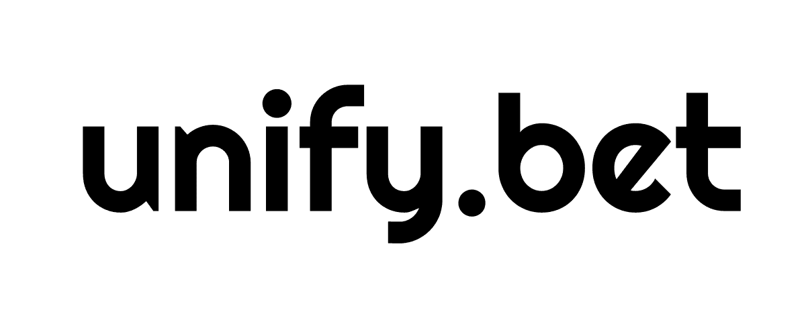

# Unify.bet - Decentralized Betting Platform

<p align="center">
  
</p>

## Overview

Unify.bet is a decentralized sports betting platform built on blockchain technology. It provides a trustless, transparent, and secure environment for users to place bets on various sporting events without intermediaries. By leveraging blockchain technology, Unify.bet eliminates the need for traditional bookmakers while ensuring fair odds, instant settlements, and complete ownership of funds.

## Our GitBook
https://ethexfi.gitbook.io/unifybet

## Key Features

- **Decentralized Betting:** Place bets directly from your crypto wallet without intermediaries
- **Transparent Odds:** All odds are generated through decentralized oracle networks and market forces
- **Real-time Updates:** Live match scores and odds updates
- **Secure Wallet Integration:** Connect with your preferred wallet through Privy's seamless integration
- **Instant Settlements:** Winnings are automatically paid out through smart contracts
- **Hybrid technology:** Self Peer-to-Peer Orderbook technology combine with automatic routing to other sportting platforms 
- **Sports Variety:** Bet on football, basketball, and more sporting events
- **User-friendly Interface:** Modern, intuitive UI designed for both crypto natives and newcomers
- **Deep Liquidity:** Integrate with other sportsbetting platform to deepen liquidity

## Technology Stack

- **Frontend:** React, TypeScript, Vite
- **Styling:** Tailwind CSS with custom UI components
- **Wallet Integration:** Privy for multi-wallet support
- **Smart Contracts:** Solidity (Ethereum, Arbitrum, Optimism)

## Getting Started

### Prerequisites

- Node.js v16+
- npm or yarn
- MetaMask or another web3 wallet

### Installation

1. Clone the repository:
   ```bash
   git clone https://github.com/yourusername/unify-bet.git
   cd unify-bet
   ```

2. Install dependencies:
   ```bash
   npm install
   ```

3. Set up environment variables:
   - Create a `.env` file in the root directory
   - Add your Privy app ID:
     ```
     VITE_PRIVY_APP_ID=your_privy_app_id
     ```

4. Start the development server:
   ```bash
   npm run dev
   ```

5. Open your browser and navigate to `http://localhost:5173`

## Usage

### Connecting Your Wallet

1. Click the "Connect Wallet" button in the top right corner
2. Select your preferred wallet provider
3. Approve the connection request in your wallet

### Placing Bets

1. Browse available matches in your preferred sport category
2. Click on odds (Home, Draw, or Away) to add a selection to your bet slip
3. Enter your stake amount in the bet slip
4. Review potential winnings
5. Click "Place Bet" to confirm your wager
6. Approve the transaction in your wallet

### Viewing Your Bets

1. Navigate to the "My Bets" section
2. View active, settled, and pending bets
3. Track your betting history and performance

## Contributing

We welcome contributions to Unify.bet! Please feel free to submit issues, pull requests, or reach out with suggestions.

## License

This project is licensed under the MIT License - see the LICENSE file for details.